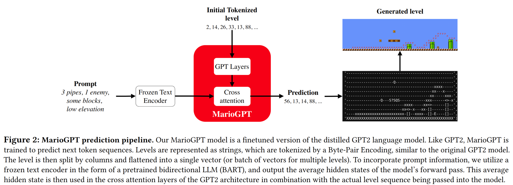

<div align="center">    

# MarioGPT: Open-Ended Text2Level Generation through Large Language Models
[](https://arxiv.org/abs/2302.05981)


</div>

---

How does it work?
----



MarioGPT is a finetuned GPT2 model (specifically, [distilgpt2](https://huggingface.co/distilgpt2)), that is trained on a subset Super Mario Bros and Super Mario Bros: The Lost Levels levels, provided by [The Video Game Level Corpus](https://github.com/TheVGLC/TheVGLC). MarioGPT is able to generate levels, guided by a simple text prompt. This generation is not perfect, but we believe this is a great first step more controllable and diverse level / environment generation.


Requirements
----
- python3.8+

Installation
---------------
from pypi
```
pip install mario-gpt
```

or from source
```
git clone git@github.com:shyamsn97/mario-gpt.git
python setup.py install
```


Generating Levels
-------------

Since our models are built off of the amazing [transformers](https://github.com/huggingface/transformers) library, we host our model in https://huggingface.co/shyamsn97/Mario-GPT2-700-context-length

This code snippet is the minimal code you need to generate a mario level!

```python
from mario_gpt.lm import MarioLM
from mario_gpt.utils import view_level, convert_level_to_png

# pretrained_model = shyamsn97/Mario-GPT2-700-context-length

mario_lm = MarioLM()

prompts = ["many pipes, many enemies, some blocks, high elevation"]

# generate level of size 700
generated_level = mario_lm.sample(
    prompts=prompts,
    num_steps=699,
    temperature=2.0,
    use_tqdm=True
)

# show string list
view_level(generated_level, mario_lm.tokenizer)
...
```
##### See [notebook](notebooks/Sampling.ipynb) for a more in depth tutorial to generate levels


## Future Plans
Here's a list of some stuff that will be added to the codebase!

- [x] Basic inference code
- [ ] Training code from paper
- [ ] Open-ended level generation code
- [ ] Different generation methods (eg. constrained beam search, etc.)


Authors
-------
Shyam Sudhakaran <shyamsnair@protonmail.com>, <https://github.com/shyamsn97>

Miguel González-Duque <migd@itu.dk>, <https://github.com/miguelgondu>

Claire Glanois <clgl@itu.dk>, <https://github.com/claireaoi>

Matthias Freiberger <matfr@itu.dk>, <https://github.com/matfrei>

Elias Najarro <enaj@itu.dk>, <https://github.com/enajx>
 
Sebastian Risi <sebr@itu.dk>, <https://github.com/sebastianrisi>

Citation
------
If you use the code for academic or commecial use, please cite the associated paper:
```
@misc{https://doi.org/10.48550/arxiv.2302.05981,
  doi = {10.48550/ARXIV.2302.05981},
  
  url = {https://arxiv.org/abs/2302.05981},
  
  author = {Sudhakaran, Shyam and González-Duque, Miguel and Glanois, Claire and Freiberger, Matthias and Najarro, Elias and Risi, Sebastian},
  
  keywords = {Artificial Intelligence (cs.AI), Computation and Language (cs.CL), FOS: Computer and information sciences, FOS: Computer and information sciences},
  
  title = {MarioGPT: Open-Ended Text2Level Generation through Large Language Models},
  
  publisher = {arXiv},
  
  year = {2023},
  
  copyright = {arXiv.org perpetual, non-exclusive license}
}

```